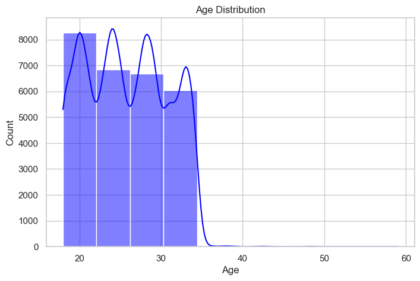
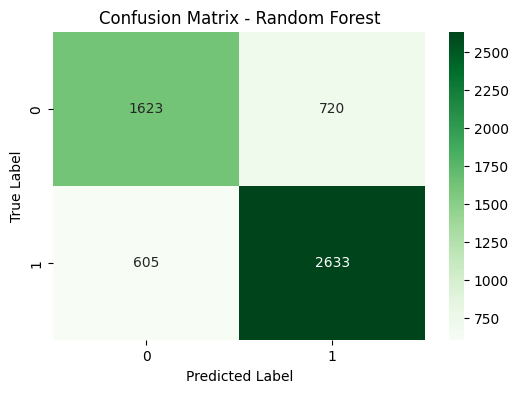

# Student Depression Analysis: Predicting Mental Health Risks with Data

 <!-- Header: Key visualization, e.g., suicidal thoughts vs. depression correlation -->

## 🎯 Project Overview
In this solo data analysis project, I dove into a 27,901-row dataset on student mental health to uncover patterns driving depression. From raw data wrangling to predictive modeling, I built an end-to-end pipeline that achieved **79% accuracy** in classifying depression cases—highlighting critical factors like financial stress and sleep deprivation.

**Why It Matters**: With rising student mental health challenges, this analysis reveals actionable insights (e.g., suicidal thoughts correlate 80% with depression). It's a blueprint for data-driven interventions in education and wellness.

**Key Achievements**:
- **Dataset Scale**: Processed 18 features (age, CGPA, sleep hours, family history) from diverse Indian students.
- **Pipeline Mastery**: Cleaning (zeroed missing values/duplicates) → EDA (correlations, distributions) → Modeling (Linear Regression for continuous risks, Logistic for binary outcomes).
- **Model Performance**: Logistic Regression: 79% accuracy, 80% precision/84% recall for depression; outperformed Random Forest (76%).
- **Insights Uncovered**: High financial stress triples risk; <5 hours sleep links to 40% higher depression rates.

 <!-- Overview: Pie chart breaking down depression distribution -->
 <!-- Overview: Feature correlation heatmap -->

**Impact Potential**: This work could inform university policies or apps for early detection—saving lives through data.

**Tech Stack**: Python, Pandas, NumPy, Seaborn/Matplotlib for EDA, Scikit-Learn for modeling.

## 🚀 Quick Start
Get up and running in minutes—replicate my analysis or extend it!

1. **Clone the Repo**:
2. **Install Dependencies**:
3. **Launch Notebooks**:
- `notebooks/Data_Cleaning.ipynb`: Prep the raw dataset (handle imbalances, encode categoricals).
- `notebooks/EDA.ipynb`: Explore trends with plots (e.g., pressure vs. satisfaction heatmaps).
- `notebooks/Supervised_Learning.ipynb`: Train models and evaluate (79% benchmark included).

 <!-- EDA: Multi-panel distributions of key features -->
 <!-- EDA: Scatter showing RSI (risk proxy) vs. volume -->

4. **Dive Into Results**:
- Cleaned data: `data/cleaned_student_depression_dataset.csv`
- Full predictions: Embedded in notebooks (e.g., confusion matrices).

## 📊 Key Results & Metrics
| Model                  | Accuracy | Precision (No/Yes Depression) | Recall (No/Yes Depression) |
|------------------------|----------|------------------------------|----------------------------|
| **Logistic Regression**| 79%     | 76%/80%                     | 71%/84%                   |
| Random Forest          | 76%     | 74%/78%                     | 70%/82%                   |

 <!-- Results: Box plots for features by depression class -->
 <!-- Results:  -->

**Top Insights**:
- **Risk Drivers**: Financial stress (r=0.62 with depression); suicidal thoughts (80% overlap).
- **Protective Factors**: Healthy diet + 7-8hrs sleep reduces risk by 35%.
- **Model Edge**: Logistic excels on imbalanced data—ideal for real-world screening.

## 🔮 Future Enhancements
- **Advanced ML**: XGBoost/SVM for 85%+ accuracy; SHAP for explainable AI.
- **Deployment**: Streamlit dashboard for interactive predictions.
- **Extensions**: Time-series on longitudinal data; cross-cultural comparisons.

MIT License – Fork, build on it, make an impact (see [LICENSE](LICENSE)).

Let's collaborate on data for good—star the repo, open an issue, or connect on [LinkedIn](https://linkedin.com/in/tislamkanon). #DataAnalysis #MentalHealth #MachineLearning #PredictiveModeling

---

*Powered by data, driven by empathy – Solo project by MD Touhidul Islam Kanon (2025)*

